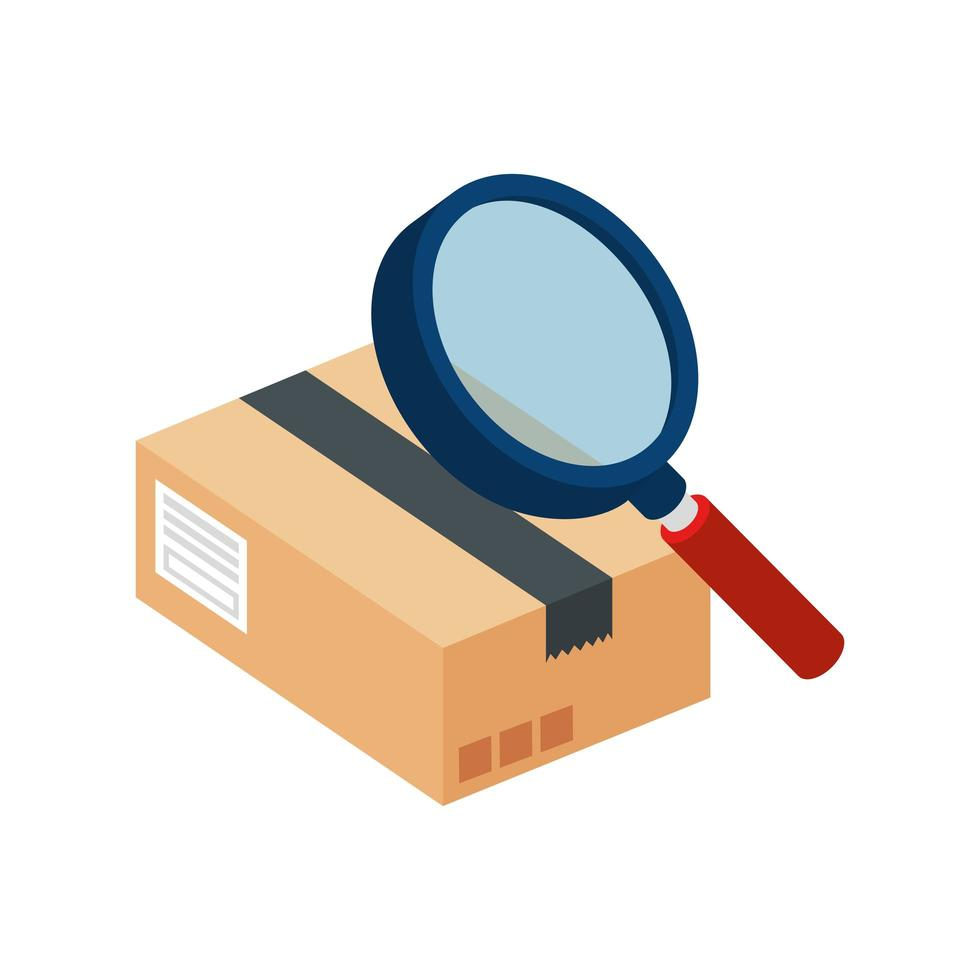

 

  

<h3 align="center">Box Buddy</h3>

  

    Never ask what's in the box again
     
    <a href="https://iandday.github.io/box_buddy/"><strong>Explore the docs »</strong></a>
     
     
    <a href="https://github.com/iandday/box_buddy">View Demo</a>
    &middot;
    <a href="https://github.com/iandday/box_buddy/issues/new?labels=bug&template=bug-report---.md">Report Bug</a>
    &middot;
    <a href="https://github.com/iandday/box_buddy/issues/new?labels=enhancement&template=feature-request---.md">Request Feature</a>
  

  
Table of Contents

  <ol>
    <li>
      <a href="#about-the-project">About The Project</a>
      <ul>
        <li><a href="#built-with">Built With</a></li>
      </ul>
    </li>
    <li><a href="#roadmap">Roadmap</a></li>
    <li><a href="#contributing">Contributing</a></li>
    <li><a href="#license">License</a></li>
    <li><a href="#acknowledgments">Acknowledgments</a></li>
  </ol>

## About The Project

[![Box Buddy Screen Shot][product-screenshot]](https://example.com)

Box Buddy is designed to keep track of storage box contents, maintaining a parent/child relationship.  A box can be anything from a plastic tote, a shelf, or an entire room.

(<a href="#readme-top">back to top</a>)

### Built With

* 
* 
* 
* 
* 
* 
* 

* 
* 

(<a href="#readme-top">back to top</a>)

## Roadmap

- [ ] Data Model
- [ ] User Interface
- [ ] API
- [ ] Data Import/Export

See the [open issues](https://github.com/iandday/box_buddy/issues) for a full list of proposed features (and known issues).

(<a href="#readme-top">back to top</a>)

## Contributing

Contributions are what make the open source community such an amazing place to learn, inspire, and create. Any contributions you make are **greatly appreciated**.

If you have a suggestion that would make this better, please fork the repo and create a pull request. You can also simply open an issue with the tag "enhancement".
Don't forget to give the project a star! Thanks again!

1. Fork the Project
2. Create your Feature Branch (`git checkout -b feature/AmazingFeature`)
3. Commit your Changes (`git commit -m 'Add some AmazingFeature'`)
4. Push to the Branch (`git push origin feature/AmazingFeature`)
5. Open a Pull Request

(<a href="#readme-top">back to top</a>)

### Top contributors:

<!-- LICENSE -->
## License

Distributed under the GNU General Public License. See `LICENSE.md` for more information.

(<a href="#readme-top">back to top</a>)

<!-- ACKNOWLEDGMENTS -->
## Acknowledgments

* 
* 
* 

(<a href="#readme-top">back to top</a>)

[product-screenshot]: images/screenshot.png
